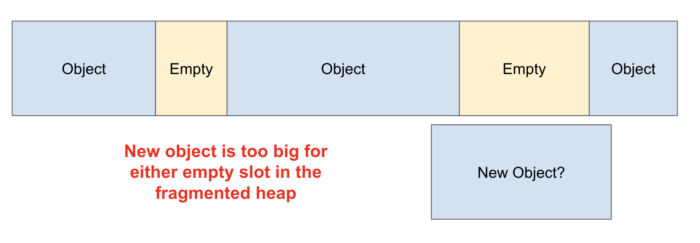
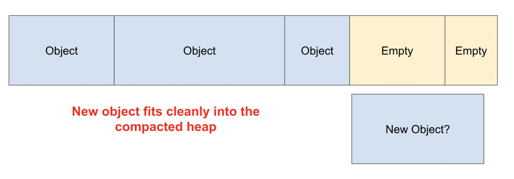

# 🌪️ Tornado Allocator


<div style="
<div class="flex-container" style="display: flex;
    gap: 20px;">
    
    
</div>


 


An efficient memory allocator designed for large objects, offering O(1) amortized allocation and O(1) deallocation, on-demand defragmentation with a first-fit allocation strategy and a GC.

	
### TODO
- **Adding tcalloc & trealloc similar to calloc and realloc**


## About project

This is my first project in C as a beginner. There are many concepts and materials that I still don’t fully understand, but I am doing my best. I am studying computer science for about 8 to 9 months, In the meanwhile i have realized that system programming is incredibly exciting, which motivated me to focus my efforts on it. For my first tool, I chose C because it is special; it provides a great deal of control over hardware.
A few days ago, I started learning C. Prior to this, I was working on a compiler for my programming language in Lisp. I found that memory management in C is more challenging than I initially thought. After further study, I learned about a concept called "fragmentation." When using malloc and free repeatedly, fragmentation can occur, leading to inefficiencies.
To address this issue, I decided to create a memory management system similar to malloc and free that minimizes memory fragmentation. This system can effectively handle large objects since the metadata for each object on a 64bit System is approximately 32 bytes. However, for embedded systems, this approach may not be efficient enough since most embedded systems have very limited memory, often under 1 MB, a metadata size of 32 bytes per object is inefficient, or it's not? You know better than me :) , so I plan to develop another project specifically tailored for those systems soon. For now, my solution can be used on general-purpose computers without any problems. 
The algorithm uses on-demand defragmentation with a first-fit allocation strategy. This approach involves reorganizing memory to consolidate fragmented free space into larger contiguous blocks only when necessary. By doing so, it helps ensure that memory requests can be satisfied without excessive delay, improving overall system efficiency. For the first-fit allocation strategy, the system allocates the first available memory partition that meets the size requirements of a process. This method is straightforward and typically results in faster allocation times compared to other strategies, as it scans the memory from the beginning until it finds a suitable block.
 
## Usage 

To start , include the tmalloc.h header file at the top of your program

```C
#include "tmalloc.h"
```

### **Garbage Collection**
The garbage collector used in this system is almost precise, as you might know, C does not support a real precise garbage collection like languages such as Python or JavaScript due to the limitations in accessing memory segments. This garbage collector can only work with local variables; other memory segments are not supported yet. GC can achieve greater precision (being more precise) by increasing the GC level of the memory pool. While a higher GC level may result in longer processing times, levels 2 or 3 are generally sufficient for most applications. However, if your program allocates a significant amount of memory and you have neglected to deallocate a large number of objects, you may consider setting the GC level even higher to improve memory management.
***GC optimization is enabled by default in Tornado. If this option is active, it is not necessary to increase the GC level***. 


- To enable garbage collection for any memory pool, define "TORNADO_CONF_GC" at the top of your main function. This is crucial for proper initialization. 

```C
int main(int argc, char const *argv[])
{
	TORNADO_CONF_GC;
	// your code	
}
```

- initialize a memory heap with tornado_initial_memory_heap(size), where size is the amount of memory to reserve for allocations. For example:

```C
TornadoMemory* tm = tornado_initial_memory_heap(1024);  // Initializes a heap of 1024 bytes
```

- You can activate garbage collection for a specific memory pool using tornado_set_gc(), and disable it with tornado_unset_gc().
If you want to use GC, it is important to note that you cannot allocate memory within the main function.

```C
tornado_set_gc(tm); 
tornado_unset_gc(tm); 
```

- If GC optimization is disabled, To enhance garbage collection (GC) and reduce memory leaks, use "tornado_set_gc_level()" function below. The GC level must be set to at least 1. if GC optimization is enabled, this function will not throw an error if called, but it is important to note that the optimization currently operates most efficiently and accurately at level 1. Changing the GC level will not impact the process and process always works at level 1.

```C
tornado_set_gc_level(tm ,2); // Level 2 or 3 is great
```

- To enable/disable GC optimization use these : 

```C
tornado_set_gc_op(tm); 
tornado_unset_gc_op(tm);
```

### Partial defragmentation

- If you wish to utilize partial defragmentation, you can control this feature using the tornado_set_defrag_op() and tornado_unset_defrag_op() functions. Use tornado_set_defrag_op() to enable partial defragmentation, and call tornado_unset_defrag_op() when you want to disable it. This allows for greater flexibility in managing memory and optimizing performance based on your application's needs. 

```C
tornado_set_defrag_op(tm); // Enabling partial defragmentation for the memory pool "tm"
tornado_unset_defrag_op(tm); // Disabling partial defragmentation for the memory pool "tm"
```

### Allocating memory

- To allocate memory for a variable, first declare (or define, since some declarations also consume memory) a variable of the desired type. For example: 

```C
char* my_string;
```

- To allocate memory

```C
tornado_allocate_memory(tm, (void**)&my_string, sizeof(char) * 5);
```

This allocates 5 bytes for my_string, enough to store a 4-character string + null , similar to using malloc.

- To deallocate memory for a specific variable

```C
tornado_deallocate_memory(tm, (void**)&my_string);
```

- To deallocate all allocated objects while preserving all structures, eliminating the need to call the initial_memory_heap function afterward

```C
tornado_deallocate_all(tm);
```

- To simultaneously deallocate all memory allocations, including the initialized heap memory, use a single function call that effectively clears all allocated resources.

```C
tornado_destroy(tm);
```

## Compilation and Run

I created a Makefile that can be customized for your own configurations. The default path for the output file is set to /bin, and your source code is located in src/main.c.

To compile the project, first navigate to the root directory and use the make command. :

```bash
cd TornadoAllocator && make clean && make
```
To run the executable, navigate to the bin directory and execute gc_test or main:

```bash
cd bin && ./main
# OR
cd bin && ./gc_test
```

## Contributing
Pull requests are welcome. For major changes, please open an issue first
to discuss what you would like to change.

Please make sure to update tests as appropriate.

## License


