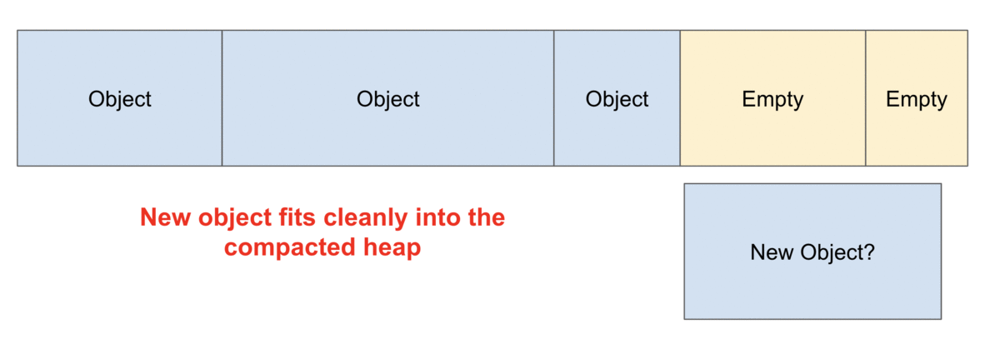

# 🌪️ Tornado Allocator


<div style="
<div class="flex-container" style="display: flex;
    gap: 20px;">
    
    
</div>


 


An efficient memory allocator, offering O(1) amortized allocation and O(1) deallocation.

### Features
- **Robust Garbage Collector which can be disabled/enabled manually at any time**
- **On-demand defragmentation with a first-fit allocation strategy**

### TODO
- **Adding tcalloc, trealloc, tstrdup similar to calloc, realloc and strdup**

## About project

This is my first project in C as a beginner. There are many concepts and materials that I still don’t fully understand, but I am doing my best. I am studying computer science for about 8 to 9 months, In the meanwhile i have realized that system programming is incredibly exciting, which motivated me to focus my efforts on it. For my first tool, I chose C because it is special; it provides a great deal of control over hardware.
A few days ago, I started learning C. Prior to this, I was working on a compiler for my programming language in Lisp. I found that memory management in C is more challenging than I initially thought. After further study, I learned about a concept called "fragmentation." When using malloc and free repeatedly, fragmentation can occur, leading to inefficiencies.
To address this issue, I decided to create a memory management system similar to malloc and free that minimizes memory fragmentation. This system can effectively handle large objects since the metadata for each object on a 64bit System is approximately 24 bytes. my solution can be used on general-purpose computers without any problems. 
The algorithm uses on-demand defragmentation with a first-fit allocation strategy. This approach involves reorganizing memory to consolidate fragmented free space into larger contiguous blocks only when necessary. By doing so, it helps ensure that memory requests can be satisfied without excessive delay, improving overall system efficiency. For the first-fit allocation strategy, the system allocates the first available memory partition that meets the size requirements of a process. This method is straightforward and typically results in faster allocation times compared to other strategies, as it scans the memory from the beginning until it finds a suitable block.
 
## Usage 


To start , include the talloc.h header file at the top of your program

```C
#include "talloc.h"
```

### **Considerations**
- ***Windows is not supported.***
- ***it is important to note that you must not allocate any memory within the main function.***
- ***Do not use any other allocators with this one, as the mechanisms are designed to function solely with this specific allocator.***

### **Initialization**

- define "TORNADO_CONF" at the top of your main function. This is crucial for proper initialization. 

```C
int main(int argc, char const *argv[])
{
	TORNADO_CONF;
	// your code	
}
```

- initialize a memory heap with tornado_initial_memory_heap(size), where size is the amount of memory to reserve for allocations. For example:

```C
TornadoMemory* tm = tornado_initial_memory_heap(1024);  // Initializes a heap of 1024 bytes
```

### **Garbage Collection**
The garbage collector used in this system is conservative.

- Use these functions to enable or disable garbage collection (GC) for a specific memory pool. By default, GC is enabled for any memory pool.

```C
tornado_set_gc(tm);   // Enabling GC for tm
tornado_unset_gc(tm); // Disabling GC for tm
```

### Partial defragmentation

- If you wish to utilize partial defragmentation, you can control this feature using the tornado_set_defrag_op() and tornado_unset_defrag_op() functions. Use tornado_set_defrag_op() to enable partial defragmentation, and call tornado_unset_defrag_op() when you want to disable it. This allows for greater flexibility in managing memory and optimizing performance based on your application's needs. 

```C
tornado_set_defrag_op(tm); // Enabling partial defragmentation for the memory pool "tm"
tornado_unset_defrag_op(tm); // Disabling partial defragmentation for the memory pool "tm"
```

### Allocating memory

- To allocate memory for a variable, first declare (or define, since some declarations also consume memory) a variable of the desired type. For example: 

```C
char* my_string;
```

- To allocate memory:

```C
tornado_allocate(tm, my_string ,sizeof(char) * 5);
```

This allocates 5 bytes for my_string, enough to store a 4-character string + null , similar to using malloc.

- To deallocate memory for a specific variable:

```C
tornado_free(tm, my_string);
```

- To deallocate all allocated objects in a specific memory pool while preserving all structures, eliminating the need to call the initial_memory_heap function afterward:

```C
tornado_deallocate_all(tm);
```

- To destory a specific memory pool:

```C
tornado_destroy_memory(tm);
```

- To simultaneously deallocate all memory allocations, including all initialized heap memories, use a single function call that effectively clears all allocated resources:

```C
tornado_destroy_all();
```

## Compilation and Run

I created a Makefile that can be customized for your own configurations. The default path for the output file is set to /bin, and your source code to test defragmentation is located in src/defrag_test.c and the source codes to test GC are located in src/gc_test.c src/gc_heap.c src/gc_test2.c .


To compile the project, first navigate to the root directory and use the make command :

```bash
cd TornadoAllocator && make clean && make
```
To run the executables:

```bash
./bin/defrag_test
# and 
./bin/gc_test
# and 
./bin/gc_test2
# and
./bin/gc_heap
```

## Contributing
Pull requests are welcome. For major changes, please open an issue first
to discuss what you would like to change.

Please make sure to update tests as appropriate.

## License


